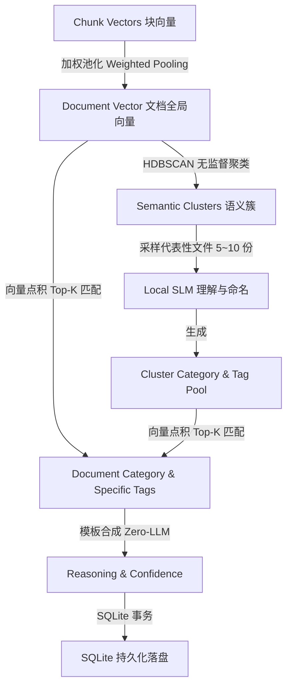

# 端侧全动态语义分类与打标签引擎架构设计方案 (Phase 3)

本方案旨在为 `steward` 建立 100% 端侧运行、零硬编码规则、高扩展且极致高效的**动态语义分类与打标签引擎**（Dynamic Semantic Classification & Tagging Engine）。

系统核心遵循：**“算法负责发现结构，LLM 负责语义命名，向量矩阵负责海量匹配”** 的分工哲学。

---

## 一、 整体架构与分工哲学

系统将推理重任解耦为三大算力层：

```text
 ┌─────────────────────────────────────────────────────────────┐
 │ 1. 无监督聚类层 (HDBSCAN 算法)                               │
 │    - 负责从高维向量空间自动发现文件的自然高密度归群 (Clusters)    │
 │    - 完全无需预定义分类数量 K，自动识别杂质与孤立点 (Outliers)     │
 └──────────────────────────────┬──────────────────────────────┘
                                │
 ┌──────────────────────────────▼─────────────────────────────┐
 │ 2. 端侧轻量 LLM 语义理解层 (Local SLM: Qwen2.5-3B)            │
 │    - 仅对每个 Cluster 抽取 5~10 份代表性文件做语义理解           │
 │    - 产出簇级元数据：主分类名称 (Category) + 候选标签池 (Tag Pool) │
 └──────────────────────────────┬──────────────────────────────┘
                                │
 ┌──────────────────────────────▼─────────────────────────────┐
 │ 3. 向量矩阵轻量打标层 (NumPy Matrix Multiplication)          │
 │    - 将 Tag Pool 中的候选词向量化                                │
 │    - 利用 1024 维文档向量与标签向量矩阵做点积 (Dot Product)        │
 │    - 毫秒级算出每个文档专属的 Top-K 标签及置信度                │
 └─────────────────────────────────────────────────────────────┘
```

---

## 二、 六步管道流程 (End-to-End Pipeline)



### 1. Document Embedding 聚合 (文档级向量合成)
* **输入**：已有 `chunks` 表中的 `1024` 维切片向量。
* **处理**：按字符长度加权平均（Weighted Pooling），直接在内存里合成唯一的 `document_vector` (1024 float32)。
* **优势**：开销仅几毫秒，无需再次调用 `bge-m3` 模型。

### 2. Semantic Cluster 生成 (无监督语义聚类)
* **算法**：采用 **HDBSCAN**（基于密度的层次聚类）。
* **产出**：将文档归纳为 $N$ 个高密度聚类簇，自动识别噪声离群文件（Outliers）。

### 3. Cluster 语义理解与候选标签池 (Local SLM)
* **抽样**：从每个聚类簇中挑选 5~10 份距离簇质心（Centroid）最近的代表性文件。
* **LLM 任务**：调用端侧 `Qwen2.5-3B` 生成：
  ```json
  {
    "category": "财务报销",
    "tag_pool": ["发票", "滴滴", "高铁票", "酒店住宿", "餐饮", "采购", "核销"]
  }
  ```

### 4. 文档主分类与动态 Tag 分配 (矩阵点积 Top-K)
* **Tag Pool 向量化**：调用 `bge-m3` 将 `tag_pool` 中的候选词转化为 $M \times 1024$ 的标签矩阵 $\mathbf{T}$。
* **向量乘法计算**：对每个文档向量 $\mathbf{d}$，计算 $\mathbf{S} = \mathbf{d} \cdot \mathbf{T}^T$。
* **挑选特征标签**：选取得分最高的前 $K$ 个标签作为该文档的专属 Tag（例如：同属“财务报销”类，文件 A 匹配 `["滴滴", "交通"]`，文件 B 匹配 `["酒店", "住宿"]`）。

### 5. 零 LLM 消耗推理理由生成 (Template Reasoning)
* **无需调用 LLM**，通过模板快速合成：
  > `"该文件归属于 [财务报销]。主要匹配标签：滴滴, 交通发票。分类置信度：0.91"`

---

## 三、 SQLite 数据表扩展设计

除了已有的 `documents`、`categories` 和 `tags` 表，新增 **`semantic_clusters`** 语义簇表：

```sql
/* 1. 语义簇表：保存 AI 发现的聚类结构与 Tag Pool */
CREATE TABLE IF NOT EXISTS semantic_clusters (
    id INTEGER PRIMARY KEY AUTOINCREMENT,
    category_id INTEGER NOT NULL,
    centroid_vector BLOB NOT NULL,       -- 簇中心向量 (1024D float32)
    tag_pool_json TEXT NOT NULL,         -- LLM 生成的候选标签池 JSON 数组
    summary TEXT,                        -- 簇级内容摘要
    confidence REAL NOT NULL,
    created_at TEXT NOT NULL,
    FOREIGN KEY (category_id) REFERENCES categories(id) ON DELETE CASCADE
);

/* 2. documents 表扩展：新增簇关联 */
ALTER TABLE documents ADD COLUMN cluster_id INTEGER REFERENCES semantic_clusters(id);
```

---

## 四、 方案总结与核心优势

1. **解决性能痛点**：对于 10,000 个文档，LLM **仅需推理 10~20 次（对聚类簇）**，整体分类耗时从 30 分钟骤降至 10 秒以内！
2. **解决分类质量**：主分类保持归纳抽象（`Category`），个体标签体现差异化细节（`Tags`），既有秩序又保留个性。
3. **零云端依赖**：全流程依赖 `numpy` + `HDBSCAN` + 端侧 3B SLM，100% 本地隐私安全。
